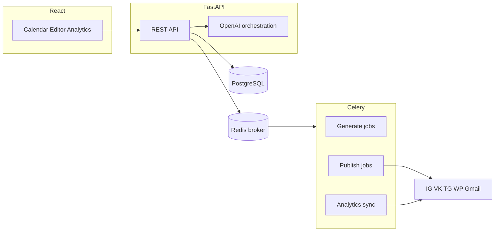

# Техническое задание: ContentForge

AI-платформа планирования, генерации и мультиканальной публикации контента.

---

## 0. Паспорт документа

| Поле | Значение |
| --- | --- |
| Название документа | Техническое задание на разработку платформы ContentForge |
| Версия | 1.1 |
| Дата | 17.08.2026 |
| Статус | Черновик к согласованию |
| Заказчик / контекст | Учебно-практический проект: комплексная система контент-маркетинга с AI |
| Стек | Python, FastAPI, React (Vite + TypeScript), PostgreSQL, SQLAlchemy, Celery, Redis, OpenAI API |
| Язык документа | Русский |
| Автор | Команда разработки ContentForge |

### 0.1. История изменений

| Версия | Дата | Что сделано |
| --- | --- | --- |
| 1.0 | 17.08.2026 10:38 UTC+8 | Первая полная разработческая редакция ТЗ: продукт, ЦА, сценарии, экраны, FR/NFR, архитектура, модель данных, API-контракты, интеграции, AI-пайплайн, риски, фазы, критерии приёмки |
| 1.1 | 17.08.2026 12:56 UTC+8 | Email-канал: Mailchimp заменён на Gmail (SMTP + App Password / Gmail API). Причина: Mailchimp недоступен из РФ, KYC/геолокация для регистрации непроходимы. Добавлены список получателей в нашей БД, лимиты Google, честные метрики без opens/clicks |

### 0.2. Как читать документ

- Формулировки «система должна» — обязательные требования, проверяемые при приёмке.
- Идентификаторы `FR-*`, `NFR-*`, `UC-*`, `AC-*` — стабильные ссылки для бэклога и тестов.
- Целевое поведение описано полностью. Срез, который реализуется первым, зафиксирован в разделе 17 (фазы). Instagram App Review и split-audience в соцсетях не блокируют MVP.

---

## 1. Название и описание проекта

### 1.1. Название

**ContentForge** — AI-платформа для планирования, создания, публикации и аналитики контента во всех рабочих каналах бренда.

### 1.2. Краткое описание

ContentForge закрывает цикл контент-маркетинга в одном рабочем месте:

1. Собрать бренд-профиль (голос, ЦА, офферы, запреты).
2. Сгенерировать контент-план на месяц с учётом праздников РФ и сигналов трендов.
3. Создать черновики: посты для соцсетей, статьи для блога, письма для email.
4. Согласовать, адаптировать под канал и поставить в очередь автопостинга.
5. Опубликовать в Instagram, VK, Telegram, WordPress, Gmail.
6. Собрать метрики, сравнить каналы, провести A/B-тест вариантов.

Пользователь работает не с пятью кабинетами и таблицей в Google Sheets, а с календарём, редактором и очередью публикаций.

### 1.3. Бизнес-задачи, которые закрывает продукт

| Бизнес-задача | Как закрывается |
| --- | --- |
| Автоматизация контент-маркетинга | AI-план на месяц, генерация черновиков, расписание, retry публикаций |
| Управление всеми каналами | Единый календарь и очередь; адаптеры Instagram, VK, Telegram, WordPress, Gmail |
| Персонализация контента | Бренд-профиль, голос, сегмент ЦА, адаптация длины/формата под канал |
| Аналитика эффективности | Сбор метрик с каналов, единый дашборд, сравнение периодов, A/B |

### 1.4. Цель проекта

Дать маркетологу или агентству воспроизводимый конвейер «план → черновик → публикация → факт», в котором AI ускоряет производство, а человек остаётся на контроле фактов, тона и допуска к каналам.

---

## 2. Глоссарий

| Термин | Определение |
| --- | --- |
| Workspace | Рабочее пространство (агентство или компания). Граница биллинга, пользователей и брендов. |
| Бренд-профиль (Brand Kit) | Карточка бренда: ЦА, голос, офферы, стоп-слова, примеры постов, языки. |
| Канал | Внешняя площадка публикации: `instagram`, `vk`, `telegram`, `wordpress`, `gmail`. |
| Подключение канала (ChannelAccount) | Связка workspace/бренда с конкретным аккаунтом площадки и зашифрованными токенами. |
| Список получателей | Адреса рассылки бренда, хранятся у нас. Gmail не даёт Audience/сегменты как ESP. |
| Контент-план | Набор слотов на календарный месяц для одного бренда. |
| Слот (PlanItem) | Ячейка плана: дата, канал, тема, цель, статус, ссылка на единицу контента. |
| Единица контента (ContentPiece) | Логический материал: пост, статья или письмо. Может иметь несколько вариантов и несколько публикаций. |
| Вариант (ContentVariant) | Текст/медиа конкретной версии (A или B, или канал-адаптация). |
| Публикация (Publication) | Факт или намерение выложить вариант в конкретный канал в конкретное время. |
| Эксперимент (A/B) | Сравнение двух вариантов по выбранной метрике за окно теста. |
| Праздник | Запись календаря РФ (и опционально кастомные даты бренда), влияющая на темы слотов. |
| Тренд-сигнал | Внешняя или ручная подсказка («тема набирает»), которую AI может учесть, но не обязан ставить в план без пометки. |
| Идемпотентный ключ | Уникальный ключ джобы (генерация/публикация), повторный запуск с тем же ключом не создаёт дубль. |

---

## 3. Целевая аудитория и боли

### 3.1. Сегменты

**Сегмент A — контент-маркетолог / SMM малого и среднего бизнеса**

- JTBD: «Каждый месяц закрыть сетку постов, статью и рассылку, не утонув в операционке».
- Контекст: 1–3 бренда, команда 1–3 человека, бюджет на инструменты ограничен.
- Критерий успеха: план на месяц за 30–60 минут, а не за 1–2 дня; публикации уходят без ручного копипаста в каждый кабинет.

**Сегмент B — digital-агентство**

- JTBD: «Вести 5–30 клиентских брендов в одном контуре, не смешивая доступы и голос».
- Контекст: несколько Owner/Editor, клиент иногда смотрит календарь, отчётность по каналам обязательна.
- Критерий успеха: изоляция брендов, единый отчёт для клиента, повторяемый процесс онбординга.

**Сегмент C — владелец бизнеса, ведущий каналы сам**

- JTBD: «Не нанимать SMM на фулл-тайм, но не пропадать из ленты и email».
- Контекст: один человек, слабая экспертиза в копирайтинге, боится «кривых» постов от нейросети.
- Критерий успеха: понятный мастер плана, превью «как будет выглядеть», ручное подтверждение перед постом.

### 3.2. Боли

1. План собирается вручную в таблице: праздники пропускаются, темы повторяются, нет привязки к каналу.
2. Контент пишется отдельно под каждую площадку; копипаст ломает лимиты символов и тон.
3. Публикация размазана по Instagram / VK / Telegram / WP / Gmail; легко забыть слот.
4. Нет единой картины эффективности: охваты в одном кабинете, открытия писем — в другом.
5. A/B почти не делается: в соцсетях нет честного split, в почте — отдельный конструктор.
6. AI-черновики без бренд-профиля галлюцинируют факты, даты акций и юридические формулировки.
7. Агентство не может безопасно хранить клиентские токены и аудит «кто нажал Опубликовать».

### 3.3. Ценность продукта по сегментам

| Сегмент | Главная ценность |
| --- | --- |
| A | Скорость цикла «месяц закрыт» + автопостинг |
| B | Мультибренд, роли, аудит, отчёт для клиента |
| C | Мастер с превью и обязательным approve |

---

## 4. Цели, границы, out of scope

### 4.1. Цели продукта

- G1. Пользователь получает согласованный контент-план на календарный месяц за один проход мастера.
- G2. Пользователь получает редактируемые черновики трёх типов: социальный пост, статья, email.
- G3. Пользователь публикует контент в подключённые каналы по расписанию без ручного входа в кабинет площадки (где API это позволяет).
- G4. Пользователь видит сводку метрик по каналам за выбранный период.
- G5. Пользователь может запустить A/B двух вариантов и зафиксировать победителя.

### 4.2. Границы (in scope)

- Один workspace → много брендов.
- Каналы: Instagram, VK, Telegram, WordPress, Gmail.
- Email: отправка со своего Gmail на свой (или явно разрешённый) список получателей в БД ContentForge. Mailchimp **вне скоупа**: сервис недоступен из РФ, регистрация требует проверяемый адрес/гео.
- Контент: текст + изображения по URL/загрузке (не видео-продакшн).
- Календарь праздников РФ + пользовательские даты бренда.
- Тренды: ручной ввод и/или подключаемый провайдер сигналов (см. открытые вопросы).
- Только собственные аккаунты пользователя или аккаунты клиента при явном разрешении.

### 4.3. Out of scope

Система **не должна** в рамках данного ТЗ:

- Быть CRM, биллингом заказов, складом или службой поддержки.
- Управлять рекламными кабинетами (Meta Ads, VK Ads, Google Ads) и ставками.
- Генерировать и публиковать Reels / Stories / короткие видео как отдельный продакшн-модуль (допускается только текстовый слот «идея ролика» без автопостинга видео в MVP).
- Постить в личный аккаунт Telegram пользователя (только канал/группа, где бот — администратор).
- Постить в личный (non-Professional) Instagram без Graph API.
- Модерировать чужие комментарии, делать community management 24/7.
- Хранить платёжные данные карт.
- Давать доступ к аккаунтам третьих лиц без разрешения владельца.
- Интегрировать Mailchimp / другие ESP (Klaviyo, UniSender, Sendsay) — email только через Gmail отправителя.
- Массовый маркетинг на купленные базы: Gmail не ESP, лимит Google ~500 писем/сутки на обычный аккаунт. Тесты — свои 2–10 адресов.

### 4.4. Дисклеймер по персональным данным

Публикация и аналитика допускаются только для аккаунтов, которыми владеет пользователь, либо для аккаунтов клиента при зафиксированном разрешении (чекбокс + запись в AuditLog). Адреса EmailRecipient — только свои или с явным согласием; система не скрейпит чужие базы. Агрегированные метрики соцсетей — только то, что отдают API площадок.

---

## 5. Роли и права

### 5.1. Роли

| Роль | Назначение |
| --- | --- |
| Owner | Владелец workspace: биллинг-заготовка, пользователи, подключение каналов, удаление бренда |
| Editor | Создание планов, генерация, редактирование, постановка в очередь, публикация (если Owner разрешил) |
| Analyst | Только календарь (read), аналитика, эксперименты (read + фиксация вывода, без публикации) |
| Viewer | Только просмотр календаря и превью (клиент агентства) |

### 5.2. Матрица доступа

| Действие | Owner | Editor | Analyst | Viewer |
| --- | --- | --- | --- | --- |
| Управление пользователями workspace | да | нет | нет | нет |
| CRUD бренда | да | да (кроме удаления) | нет | нет |
| Подключение / отзыв канала | да | опционально (флаг workspace) | нет | нет |
| Генерация плана и контента | да | да | нет | нет |
| Публикация / отмена | да | да | нет | нет |
| Аналитика | да | да | да | нет |
| Создание A/B | да | да | нет | нет |
| Просмотр календаря | да | да | да | да |

Изоляция: пользователь видит только бренды своего workspace. Токены каналов не отдаются на клиент в открытом виде.

---

## 6. Пользовательские сценарии

### UC-01. Регистрация и создание workspace

**Актор:** новый пользователь.  
**Предусловие:** нет аккаунта.  
**Основной поток:**

1. Пользователь регистрируется email + пароль.
2. Система создаёт User и Workspace, роль Owner.
3. Пользователь попадает на онбординг бренда (UC-02) или на пустой Dashboard.

**Альтернатива:** вход по уже существующему email — отказ с кодом `email_taken`.

### UC-02. Онбординг бренд-профиля

**Актор:** Owner / Editor.  
**Основной поток:**

1. Пользователь вводит название бренда, нишу, ЦА, голос (тон, стоп-слова), 3–5 офферов, язык по умолчанию (ru/en).
2. Опционально загружает 2–5 эталонных постов.
3. Система сохраняет BrandProfile и предлагает подключить хотя бы один канал.

**Постусловие:** бренд готов к генерации плана. Генерация без бренд-профиля запрещена.

### UC-03. AI-план на месяц

**Актор:** Editor.  
**Предусловие:** есть BrandProfile.  
**Основной поток:**

1. Пользователь выбирает бренд, месяц, каналы, частоту (например 12 постов / 4 статьи / 4 письма).
2. Система подмешивает праздники РФ и активные тренд-сигналы месяца.
3. Пользователь запускает генерацию; видит статус job.
4. Система создаёт ContentPlan + PlanItem со статусом `draft`.
5. Пользователь правит темы, даты, каналы, удаляет/добавляет слоты, утверждает план (`approved`).

**Альтернатива:** OpenAI недоступен — job `failed`, план не создаётся, пользователь видит причину и может повторить.

### UC-04. Генерация поста / статьи / письма

**Актор:** Editor.  
**Основной поток:**

1. Из слота или из редактора пользователь запускает генерацию ContentPiece нужного типа.
2. Система учитывает бренд, канал, тему слота, лимиты площадки.
3. Создаётся ContentPiece + вариант A (`draft`).
4. Пользователь редактирует текст, CTA, хештеги, обложку; сохраняет; может запросить «перегенерировать абзац».

**Альтернатива:** пользователь пишет текст полностью вручную — AI не обязателен.

### UC-05. Постановка слота в календарь и расписание

**Актор:** Editor.  
**Основной поток:**

1. Пользователь назначает datetime публикации (таймзона бренда).
2. Выбирает подключение канала и вариант контента.
3. Система создаёт Publication со статусом `scheduled`.
4. Слот в календаре отражает статус.

**Ограничение:** нельзя запланировать публикацию в канал, который не подключён, кроме статуса `manual_copy` (пользователь скопирует сам).

### UC-06. Автопостинг

**Актор:** система (Celery Beat) + Editor как наблюдатель.  
**Основной поток:**

1. По наступлении `scheduled_at` воркер берёт Publication.
2. Адаптер канала публикует контент, сохраняет `external_id`.
3. Статус → `published`. Пишется AuditLog.

**Альтернатива (срыв):** API площадки 4xx/5xx / rate limit — статус `failed`, retry по политике (раздел 9.3), уведомление в UI. После исчерпания попыток — `dead`, пользователь может «повторить сейчас» или перевести в `manual_copy`.

### UC-07. Срыв публикации и ручной обход

**Актор:** Editor.  
**Основной поток:**

1. Пользователь открывает очередь, видит `failed`/`dead`.
2. Смотрит код ошибки адаптера (без секретов).
3. Правит текст/медиа или переподключает канал.
4. Нажимает Retry либо копирует текст (clipboard) для ручной публикации и отмечает `published_manual`.

### UC-08. Сводная аналитика

**Актор:** Analyst / Editor / Owner.  
**Основной поток:**

1. Пользователь выбирает бренд и период.
2. Система показывает агрегированные метрики по каналам и список публикаций с фактами.
3. Пользователь может открыть одну публикацию и увидеть сырой снимок метрик.

**Альтернатива:** канал не отдаёт insights (нет прав / App Review) — блок канала в состоянии `metrics_unavailable`, остальные каналы работают.

### UC-09. A/B эксперимент

**Актор:** Editor.  
**Основной поток:**

1. Пользователь создаёт вариант B того же ContentPiece.
2. Задаёт окно теста, первичную метрику, режим (см. FR-AB).
3. Система публикует A и B согласно режиму.
4. По окончании окна система считает результат, предлагает победителя.
5. Пользователь подтверждает победителя; система может создать follow-up Publication победившего варианта (если включено).

### UC-10. Отзыв доступа канала

**Актор:** Owner.  
**Основной поток:**

1. Пользователь отзывает ChannelAccount.
2. Токены уничтожаются.
3. Запланированные публикации этого канала переходят в `cancelled` с причиной `channel_revoked`.
4. Исторические Publication и снимки аналитики сохраняются.

---

## 7. Экраны React

Общие правила UI:

- Все экраны бренда требуют выбранный `brand_id` (переключатель в шапке).
- Длинные операции (генерация, публикация) — не блокируют навигацию; статус в тосте + в центре джоб.
- Пустые состояния с одним CTA, не «нет данных».

### SCR-AUTH — Вход / регистрация

- Цель: сессия пользователя.
- Блоки: форма email/пароль, переключение login/register, ошибка API.
- Действия: Submit → cookie/JWT, редирект на Dashboard или онбординг.

### SCR-ONB — Онбординг Brand Kit

- Цель: заполнить профиль, без которого AI не стартует.
- Блоки: шаги (о бренде → ЦА и голос → офферы → эталоны → каналы).
- Действия: сохранить черновик шага, завершить онбординг, пропустить каналы (с предупреждением).

### SCR-DASH — Dashboard

- Цель: состояние текущего месяца.
- Блоки: KPI (слоты / опубликовано / failed / черновики), ближайшие 7 публикаций, алерты джоб, мини-календарь.
- Действия: «Сгенерировать план», «Открыть очередь», переход в слот.

### SCR-CAL — Календарь

- Цель: месяц как источник правды по слотам.
- Блоки: grid месяца, фильтр каналов, легенда статусов, боковая панель слота.
- Действия: drag-and-drop даты (если `draft`/`scheduled`), открыть редактор, создать слот вручную.

### SCR-PLAN — Мастер плана

- Цель: UC-03.
- Блоки: параметры месяца/частоты/каналов, превью праздников и трендов, прогресс job, таблица слотов до утверждения.
- Действия: Generate, Regenerate (с подтверждением: черновики слотов перезапишутся, утверждённые публикации — нет), Approve plan.

### SCR-EDT — Редактор контента

- Цель: довести единицу контента до publishable.
- Блоки: переключатель типа (post/article/email), варианты A/B, превью лимитов канала, поля CTA/хештеги/медиа, история ревизий текста (последние N сохранений).
- Действия: Save, Generate, Rewrite selection, Create variant B, Schedule.

### SCR-CHN — Каналы

- Цель: OAuth/токен, статус здоровья, права insights.
- Блоки: карточка канала (connected / expired / missing_scopes / error), дата истечения токена, кнопка «Проверить». Для Gmail — форма SMTP (from + app password) и таблица EmailRecipient.
- Действия: Connect, Reauth, Revoke, Test post (в sandbox/тест-канал, если настроен). Gmail: Test send на свой адрес, CRUD получателей.

### SCR-QUE — Очередь публикаций

- Цель: операционка автопостинга.
- Блоки: таблица Publication (время, канал, статус, ошибка), фильтры.
- Действия: Retry, Cancel, Open content, Copy for manual.

### SCR-ANL — Аналитика

- Цель: UC-08.
- Блоки: период, карточки метрик по каналам, таблица публикаций, график по дням (сумма доступных метрик).
- Действия: смена периода, экспорт CSV (фаза 2), drill-down публикации.

### SCR-AB — A/B эксперименты

- Цель: UC-09.
- Блоки: список экспериментов, мастер создания, карточка с метриками A vs B и статусом окна.
- Действия: Start, Stop early, Declare winner.

### SCR-SET — Настройки

- Цель: workspace, пользователи, таймзона, язык UI, флаги «Editor может подключать каналы».
- Блоки: профиль, члены, опасная зона (удаление бренда).
- Действия: invite (фаза 2 можно упростить до ручного добавления email Owner’ом), смена роли.

---

## 8. Функциональные требования

Требование обязательно, если не помечено как фаза 2/3.

### 8.1. Планирование

**FR-PLN-01.** Система должна создавать контент-план на выбранный календарный месяц для одного бренда.

**FR-PLN-02.** Мастер плана должен принимать: бренд, месяц, набор каналов, целевые количества по типам (`post`, `article`, `email`), язык.

**FR-PLN-03.** Система должна подмешивать в промпт официальные праздники РФ, попадающие в месяц, из справочника Holiday.

**FR-PLN-04.** Система должна подмешивать тренд-сигналы со статусом `active` и датой пересечения с месяцем. Если сигналов нет, план генерируется без них, в UI — явное «тренды не заданы».

**FR-PLN-05.** Результат генерации — список слотов: дата, канал, тип, тема, цель (awareness/traffic/lead/retention), хук в одном предложении. Валидация JSON-схемой; невалидный ответ модели — `failed`, без частичной записи мусора.

**FR-PLN-06.** Пользователь должен иметь возможность вручную: добавить/удалить слот, сменить дату/канал/тему, пока план не в статусе, запрещающем правку слотов с уже `published` публикациями.

**FR-PLN-07.** У плана статусы: `generating` | `draft` | `approved` | `archived`. Повторная генерация `draft` допустима с подтверждением. `approved` повторно генерируется только через «создать ревизию плана» (новый ContentPlan, старый `archived`).

**FR-PLN-08.** Система не должна ставить два слота одного канала на одну и ту же минуту. Предупреждение при пересечении ±30 минут на одном канале.

### 8.2. Создание контента

**FR-CNT-01.** Система должна поддерживать типы ContentPiece: `social_post`, `article`, `email`.

**FR-CNT-02.** Генерация должна использовать BrandProfile (голос, стоп-слова, офферы, эталоны) и ограничения канала-адаптера (лимит символов, наличие хештегов, HTML для письма).

**FR-CNT-03.** Для `social_post` система должна уметь хранить: текст, CTA, хештеги, alt-текст, список media_asset_id. Адаптации: Instagram / VK / Telegram — отдельные варианты или поле `channel_overrides`.

**FR-CNT-04.** Для `article` — title, slug-черновик, excerpt, body (Markdown), SEO title/description. Целевой канал по умолчанию — WordPress.

**FR-CNT-05.** Для `email` — subject, preheader, body (HTML или Markdown→HTML), preview text. Целевой канал — Gmail. Получатели берутся из списка бренда, не из внешнего ESP.

**FR-CNT-06.** Пользователь должен редактировать любой сгенерированный текст до публикации. Опубликованный вариант иммутабелен; правки создают новую ревизию/вариант.

**FR-CNT-07.** Система должна блокировать генерацию и публикацию, если текст содержит стоп-слова бренда (регистронезависимо, список из BrandProfile). Override — роль Owner с записью в AuditLog.

**FR-CNT-08.** Перегенерация выделенного фрагмента не должна затирать невыделенный текст.

### 8.3. Публикация и автопостинг

**FR-PUB-01.** Система должна создавать Publication: content_variant_id, channel_account_id, scheduled_at (UTC + tz бренда в UI), статус.

**FR-PUB-02.** Статусы Publication: `draft` | `scheduled` | `publishing` | `published` | `published_manual` | `failed` | `dead` | `cancelled`.

**FR-PUB-03.** Воркер должен забирать `scheduled` с `scheduled_at <= now()` и переводить в `publishing` атомарно (SELECT FOR UPDATE / `UPDATE … WHERE status='scheduled'`).

**FR-PUB-04.** Успех адаптера: сохранить `external_id`, `external_url` если есть, статус `published`.

**FR-PUB-05.** Ошибка адаптера: сохранить `error_code`, `error_message` (без токенов), статус `failed`. Retry: 3 попытки, backoff 1m / 5m / 15m, затем `dead`.

**FR-PUB-06.** Повтор с тем же `idempotency_key` не должен создавать вторую публикацию на стороне площадки, если `external_id` уже есть.

**FR-PUB-07.** Пользователь должен отменить `scheduled` → `cancelled`. `publishing` отменяется best-effort (если площадка уже приняла — статус не откатывается молча, показывается факт).

**FR-PUB-08.** Режим `manual_copy`: система отдаёт готовый текст/файлы, пользователь отмечает `published_manual` с опциональным URL.

**FR-PUB-09.** Превью: для каждого канала — предупреждение, если текст длиннее лимита или нет обязательного медиа (Instagram feed — изображение обязательно, если адаптер в режиме photo-post).

### 8.4. Каналы

**FR-CHN-01.** Система должна хранить подключения: тип, display name, статус, scopes, `token_expires_at`, ciphertext токенов.

**FR-CHN-02.** Health-check по кнопке и по cron (не реже 1 раза в 6 часов): валидность токена, минимальные scopes.

**FR-CHN-03.** Статусы канала: `connected` | `expired` | `missing_scopes` | `error` | `revoked`.

**FR-CHN-04.** Отзыв уничтожает секреты и канселится будущие Publication (UC-10).

**FR-CHN-05.** Для канала `gmail` система должна хранить список получателей бренда (email, имя, status `active` | `unsubscribed`). Публикация email без хотя бы одного `active` адреса — 409 `no_recipients`.

**FR-CHN-06.** Отправка Gmail должна идти только на `active` адреса списка. Hard cap одной публикации в MVP: 50 получателей. Превышение суточного лимита Google (`dailyLimitExceeded` / SMTP 550) — `rate_limited` без шторма retry.

### 8.5. Аналитика

**FR-ANL-01.** Система должна периодически синкать метрики опубликованных материалов (Celery, не реже 1 раза в 6 часов для публикаций младше 14 дней, далее 1 раз в сутки до 30 дней).

**FR-ANL-02.** Хранить AnalyticsSnapshot: publication_id, captured_at, payload JSON нормализованных полей + raw.

**FR-ANL-03.** Нормализованные поля (если площадка отдаёт): impressions, reach, likes, comments, shares, clicks, saves; для Gmail — `sent`, `failed` (по SMTP/API). `opened` / `clicked` / `unsubscribed` для Gmail — `unavailable` в MVP (нет ESP-отчётов; пиксель/UTM — фаза 3). Для статьи — views, если доступны.

**FR-ANL-04.** Дашборд агрегатов по каналу и периоду: сумма/среднее доступных метрик, число публикаций, число failed.

**FR-ANL-05.** Если метрики недоступны, система не должна подставлять нули как успех: в UI состояние `unavailable`.

### 8.6. A/B тестирование

**FR-AB-01.** Эксперимент привязан к одному ContentPiece и двум вариантам A/B.

**FR-AB-02.** Пользователь задаёт: первичную метрику из доступных для канала, окно (from/to), режим публикации.

**FR-AB-03.** Режимы:

- `sequential` — A публикуется в T1, B в T2 (тот же канал). Для Instagram/VK/Telegram это основной честный режим, потому что split-audience API нет.
- `gmail_split_list` — список получателей делится пополам: нечётные → A, чётные → B, одна волна. Для 1 адреса — запрещено (нужно ≥2). Primary metric в MVP: `sent` бессмысленна как победитель; победителя по opens нет → пользователь выбирает вручную (`tie` автоматом, AC: declare winner руками) либо в фазе 3 по UTM/пикселю.
- `wordpress_title` — две статьи не плодим: тест title/excerpt на черновике не применяется; для WP в MVP A/B = sequential двух постов или тест subject не применим. Для WP допустим только sequential двух URL.

**FR-AB-04.** До закрытия окна система не объявляет победителя автоматически, кроме явного Stop early.

**FR-AB-05.** Победитель: большее значение primary metric; при равенстве — статус `tie`, пользователь выбирает вручную.

**FR-AB-06.** Применение победителя: опциональный follow-up post/email победившего текста. Не удаляет проигравший опубликованный пост.

### 8.7. Админка и аудит

**FR-AUD-01.** AuditLog на: логин, CRUD бренда, generate plan/content, schedule, publish, retry, revoke channel, override стоп-слов, declare winner.

**FR-AUD-02.** Запись: actor_id, action, entity_type, entity_id, at, ip (если есть), metadata без секретов.

---

## 9. Нефункциональные требования

**NFR-SEC-01.** Секреты каналов и OpenAI ключ только в env / secret storage. В git не хранятся. Токены в БД — encrypted at rest (Fernet или аналог, ключ из env `TOKEN_ENCRYPTION_KEY`).

**NFR-SEC-02.** API: аутентификация JWT (access + refresh) или httpOnly cookie. Authorization: проверка membership workspace + роли на каждый бренд-scoped запрос.

**NFR-SEC-03.** Пароли — hash (argon2 или bcrypt). Rate limit логина: 5 неуспешных / 10 минут / IP+email.

**NFR-SEC-04.** Клиенту не отдавать access_token площадок. Только статус подключения.

**NFR-REL-01.** Публикующие джобы идемпотентны по `idempotency_key`. Падение воркера в `publishing` старше N минут (по умолчанию 10) — watchdog возвращает в `failed` для retry, если `external_id` пуст.

**NFR-REL-02.** Очередь Celery должна переживать рестарт Redis без молчаливой потери `scheduled` (источник правды — PostgreSQL, Beat сканирует БД).

**NFR-PERF-01.** Чтение календаря месяца: p95 < 500 мс на 200 слотов (локально, без учёта сети).

**NFR-PERF-02.** Генерация плана — асинхронная job; HTTP 202, не держать запрос > 2 с.

**NFR-LIM-01.** Лимиты OpenAI и площадок: очереди, backoff, понятная ошибка `rate_limited`. Бюджет токенов на workspace (мягкий лимит, env) — отклонение 429 `quota_exceeded`.

**NFR-I18N-01.** UI: русский. Контент: ru и en, поле языка на BrandProfile и на ContentPiece.

**NFR-OBS-01.** Структурные логи: request_id, job_id, publication_id. Без тел токенов и паролей.

**NFR-COMP-01.** Дисклеймер ПДн в UI при подключении канала (чекбокс согласия).

**NFR-TZ-01.** Все моменты времени в БД — UTC. UI показывает таймзону бренда (`Europe/Moscow` по умолчанию).

---

## 10. Архитектура

### 10.1. Общая схема



### 10.2. Принципы

- React — единственный UI. FastAPI — единственный backend для UI.
- Каналы изолированы адаптерами с общим интерфейсом `ChannelAdapter`.
- Генерация и постинг не выполняются в request-thread.
- PostgreSQL — источник правды по слотам и Publication. Redis — брокер/кэш, не источник расписания.
- SQLAlchemy 2.x, миграции Alembic.

### 10.3. Компоненты backend

| Компонент | Ответственность |
| --- | --- |
| `api` | REST, auth, валидация Pydantic, постановка job |
| `domain` | бренды, планы, контент, эксперименты |
| `ai` | сбор контекста, вызов OpenAI, JSON schema validate |
| `adapters` | Instagram, VK, Telegram, WordPress, Gmail |
| `workers` | generate_plan, generate_content, publish, sync_insights, health_channels |
| `crypto` | encrypt/decrypt токенов |

### 10.4. Интерфейс адаптера (логический)

```text
publish(account, variant, media) -> { external_id, external_url }
fetch_metrics(account, external_id) -> NormalizedMetrics
health(account) -> ChannelHealth
limits() -> { max_text, media_required, supports_ab }
```

Неподдерживаемая операция → явный `AdapterCapabilityError`, не silent skip.

### 10.5. Очереди Celery

| Очередь | Задачи |
| --- | --- |
| `ai` | generate_plan, generate_content, rewrite |
| `publish` | publish_due, retry_publish |
| `sync` | sync_publication_metrics, health_check_channels |
| `beat` | scan due publications каждую минуту; sync каждые 6 часов |

### 10.6. Frontend

- Vite + React + TypeScript.
- Маршруты по экранам раздела 7.
- Состояние сервера — TanStack Query или аналог.
- Формы — React Hook Form + Zod (схемы, совместимые с контрактом API).
- Календарь — месяц, без обязательности тяжёлого enterprise-scheduler в MVP.

---

## 11. Модель данных

Связи: Workspace 1—N UserMembership, Workspace 1—N BrandProfile. Brand 1—N ChannelAccount, ContentPlan, ContentPiece, EmailRecipient. Plan 1—N PlanItem. Piece 1—N ContentVariant. Variant 1—N Publication. Publication 1—N AnalyticsSnapshot. Piece 0—1 Experiment (активный).

### 11.1. User

- `id` uuid pk
- `email` unique not null
- `password_hash` not null
- `is_active` bool
- `created_at`

### 11.2. Workspace

- `id` uuid
- `name`
- `created_at`
- `openai_soft_quota_tokens` int nullable

### 11.3. Membership

- `id` uuid
- `workspace_id` fk
- `user_id` fk
- `role` enum: owner | editor | analyst | viewer
- unique (workspace_id, user_id)

### 11.4. BrandProfile

- `id` uuid
- `workspace_id` fk
- `name`
- `niche` text
- `audience` text
- `voice_tone` text
- `stopwords` jsonb (string[])
- `offers` jsonb
- `example_posts` jsonb
- `default_locale` `ru` | `en`
- `timezone` string (IANA)
- `onboarding_completed_at` nullable

### 11.5. ChannelAccount

- `id` uuid
- `brand_id` fk
- `type` enum: instagram | vk | telegram | wordpress | gmail
- `display_name`
- `status` enum
- `scopes` jsonb
- `token_ciphertext` text
- `refresh_ciphertext` text nullable
- `token_expires_at` timestamptz nullable
- `external_account_id` string nullable
- `meta` jsonb (blog url, channel_id, ig_user_id, gmail_from, smtp_host, …)
- `revoked_at` nullable

### 11.6. Holiday

- `id`
- `date` date
- `name`
- `country` default `RU`
- `source` `system` | `brand`
- `brand_id` nullable (для кастомных)

### 11.7. TrendSignal

- `id`
- `brand_id` nullable (null = глобальный)
- `title`
- `note`
- `starts_on` / `ends_on` date
- `status` `active` | `archived`
- `source` `manual` | `provider`

### 11.8. ContentPlan

- `id`
- `brand_id`
- `year` int
- `month` int (1–12)
- `status` generating | draft | approved | archived
- `params` jsonb (частоты, каналы, locale)
- `model` string (имя модели OpenAI)
- `created_by`
- unique активный план на бренд+год+месяц: частичный unique где status in (generating, draft, approved)

### 11.9. EmailRecipient

- `id` uuid
- `brand_id` fk
- `email` citext
- `name` nullable
- `status` active | unsubscribed
- `source` `manual` | `import`
- unique (brand_id, email)

Тестовый контур: 2–10 своих адресов. Импорт CSV — фаза 2, не больше hard cap.

### 11.10. PlanItem

- `id`
- `plan_id`
- `date` date
- `channel_type`
- `content_type` social_post | article | email
- `theme` text
- `goal` awareness | traffic | lead | retention
- `hook` text
- `content_piece_id` nullable fk
- `sort_order` int

### 11.11. ContentPiece

- `id`
- `brand_id`
- `type`
- `locale`
- `status` draft | ready | archived
- `plan_item_id` nullable
- `stopword_override` bool default false

### 11.12. ContentVariant

- `id`
- `piece_id`
- `label` `A` | `B` | `adapt_ig` | … 
- `payload` jsonb (поля по типу, см. FR-CNT)
- `revision` int
- `is_immutable` bool (true после первой успешной публикации этого варианта)

### 11.13. Publication

- `id`
- `variant_id`
- `channel_account_id`
- `scheduled_at` timestamptz
- `status`
- `external_id` nullable
- `external_url` nullable
- `error_code` nullable
- `error_message` nullable
- `attempt_count` int default 0
- `idempotency_key` unique
- `experiment_id` nullable
- `published_at` nullable
- `meta` jsonb nullable (для Gmail: `{ sent_count, failed_count, recipient_ids }`; `external_id` = Message-ID первого успешного письма)

### 11.14. AnalyticsSnapshot

- `id`
- `publication_id`
- `captured_at`
- `normalized` jsonb
- `raw` jsonb

### 11.15. Experiment

- `id`
- `piece_id`
- `variant_a_id` / `variant_b_id`
- `channel_type`
- `mode` sequential | gmail_split_list | wordpress_title
- `primary_metric` string
- `window_start` / `window_end`
- `status` draft | running | completed | cancelled | tie
- `winner_variant_id` nullable

### 11.16. MediaAsset

- `id`
- `brand_id`
- `kind` image
- `storage_key`
- `mime`
- `width` / `height` nullable
- `checksum`

### 11.17. Job

- `id`
- `type`
- `status` queued | running | succeeded | failed
- `payload` jsonb
- `result` jsonb
- `error` text
- `created_by`
- `idempotency_key` unique nullable

### 11.18. AuditLog

- поля по FR-AUD-02. Append-only.

---

## 12. API-контракты FastAPI

База: `/api/v1`. Формат ошибок:

```json
{
  "error": {
    "code": "plan_not_found",
    "message": "План не найден",
    "details": {}
  }
}
```

Общие коды: `401 unauthorized`, `403 forbidden`, `404 not_found`, `409 conflict`, `422 validation_error`, `429 quota_exceeded` / `rate_limited`, `503 upstream_unavailable`.

Auth: `Authorization: Bearer <access>` или cookie сессии.

Все бренд-scoped методы: пользователь должен быть member workspace бренда.

### 12.1. `/auth`

| Метод | Путь | Тело | Ответ | Ошибки |
| --- | --- | --- | --- | --- |
| POST | `/auth/register` | `{ email, password, workspace_name }` | `{ user, workspace, tokens }` | `email_taken` |
| POST | `/auth/login` | `{ email, password }` | `{ user, workspace, tokens }` | `invalid_credentials` |
| POST | `/auth/refresh` | `{ refresh_token }` | `{ tokens }` | `invalid_refresh` |
| POST | `/auth/logout` | — | `204` | |

`tokens`: `{ access_token, refresh_token, token_type: "bearer", expires_in }`.

### 12.2. `/brands`

| Метод | Путь | Описание |
| --- | --- | --- |
| GET | `/brands` | список брендов workspace |
| POST | `/brands` | создать |
| GET | `/brands/{brand_id}` | карточка + onboarding flags |
| PATCH | `/brands/{brand_id}` | обновить Brand Kit |
| DELETE | `/brands/{brand_id}` | Owner; soft-delete допустим |

POST body (минимум): `{ name, niche, audience, voice_tone, stopwords, offers, default_locale, timezone }`.

### 12.3. `/plans`

| Метод | Путь | Описание |
| --- | --- | --- |
| GET | `/brands/{brand_id}/plans?year&month` | текущий + архив |
| POST | `/brands/{brand_id}/plans/generate` | 202 `{ job_id }` |
| GET | `/plans/{plan_id}` | план + items |
| PATCH | `/plans/{plan_id}` | status approve/archive |
| POST | `/plans/{plan_id}/items` | ручной слот |
| PATCH | `/plans/{plan_id}/items/{item_id}` | правка слота |
| DELETE | `/plans/{plan_id}/items/{item_id}` | |

POST generate body:

```json
{
  "year": 2026,
  "month": 9,
  "channels": ["telegram", "vk", "wordpress", "gmail"],
  "targets": { "social_post": 12, "article": 4, "email": 4 },
  "locale": "ru",
  "include_holidays": true,
  "include_trends": true
}
```

Конфликт: `409 plan_active_exists` если есть generating/draft/approved на этот месяц.

### 12.4. `/content`

| Метод | Путь | Описание |
| --- | --- | --- |
| GET | `/brands/{brand_id}/content` | фильтры type, status |
| POST | `/brands/{brand_id}/content` | создать пустой piece (+ опционально plan_item_id) |
| GET | `/content/{piece_id}` | piece + variants |
| PATCH | `/content/{piece_id}` | status |
| POST | `/content/{piece_id}/generate` | 202 job |
| POST | `/content/{piece_id}/variants` | создать B / адаптацию |
| PATCH | `/content/{piece_id}/variants/{variant_id}` | payload; 409 если immutable |
| POST | `/content/{piece_id}/variants/{variant_id}/rewrite` | 202, `{ selection }` |

Generate body: `{ variant_label, channel_type, extra_instructions }`.

### 12.5. `/publish`

| Метод | Путь | Описание |
| --- | --- | --- |
| GET | `/brands/{brand_id}/publications` | фильтр status, from, to |
| POST | `/brands/{brand_id}/publications` | schedule |
| POST | `/publications/{id}/cancel` | |
| POST | `/publications/{id}/retry` | только failed/dead |
| POST | `/publications/{id}/mark-manual` | `{ external_url? }` |

POST schedule:

```json
{
  "variant_id": "uuid",
  "channel_account_id": "uuid",
  "scheduled_at": "2026-09-03T09:00:00+03:00",
  "idempotency_key": "client-generated-uuid"
}
```

Ответ 201 Publication. Повтор того же ключа — 200 существующей записи.

### 12.6. `/channels`

| Метод | Путь | Описание |
| --- | --- | --- |
| GET | `/brands/{brand_id}/channels` | без секретов |
| POST | `/brands/{brand_id}/channels/{type}/oauth/start` | `{ auth_url, state }` |
| GET | `/channels/oauth/callback` | провайдер редирект |
| POST | `/brands/{brand_id}/channels/{type}/credentials` | WordPress app password / VK token / Telegram bot token / Gmail app password — `{ fields }` |
| POST | `/channels/{id}/health` | 200 health |
| DELETE | `/channels/{id}` | revoke |

Для Telegram/WordPress/VK/Gmail (SMTP) часто нет классического OAuth пользователя — credentials endpoint обязателен. Gmail OAuth (Gmail API) — опциональный путь фазы 2.

### 12.7. `/analytics`

| Метод | Путь | Описание |
| --- | --- | --- |
| GET | `/brands/{brand_id}/analytics/summary?from&to` | агрегаты по каналам |
| GET | `/publications/{id}/analytics` | snapshots |

Summary item: `{ channel_type, publications, metrics, availability }`.

### 12.8. `/experiments`

| Метод | Путь | Описание |
| --- | --- | --- |
| GET | `/brands/{brand_id}/experiments` | |
| POST | `/brands/{brand_id}/experiments` | создать |
| GET | `/experiments/{id}` | + текущие метрики A/B |
| POST | `/experiments/{id}/start` | |
| POST | `/experiments/{id}/stop` | |
| POST | `/experiments/{id}/winner` | `{ variant_id }` |

POST create:

```json
{
  "piece_id": "uuid",
  "variant_a_id": "uuid",
  "variant_b_id": "uuid",
  "channel_type": "telegram",
  "mode": "sequential",
  "primary_metric": "impressions",
  "window_start": "2026-09-01T00:00:00Z",
  "window_end": "2026-09-08T00:00:00Z",
  "schedule_a": "2026-09-01T10:00:00+03:00",
  "schedule_b": "2026-09-04T10:00:00+03:00"
}
```

### 12.9. `/jobs`

| Метод | Путь | Описание |
| --- | --- | --- |
| GET | `/jobs/{job_id}` | статус генерации |

Поллинг UI каждые 2 с, пока `queued`/`running`.

### 12.10. `/holidays` и `/trends`

| Метод | Путь | Описание |
| --- | --- | --- |
| GET | `/holidays?year&month` | системные RU + brand custom |
| POST | `/brands/{brand_id}/holidays` | кастомная дата |
| GET | `/brands/{brand_id}/trends` | |
| POST | `/brands/{brand_id}/trends` | ручной сигнал |
| PATCH | `/trends/{id}` | archive |

### 12.11. `/media`

| Метод | Путь | Описание |
| --- | --- | --- |
| POST | `/brands/{brand_id}/media` | multipart image, лимит 10 МБ, jpeg/png/webp |
| GET | `/media/{id}` | метаданные + url |

### 12.12. `/recipients`

| Метод | Путь | Описание |
| --- | --- | --- |
| GET | `/brands/{brand_id}/recipients` | список адресов |
| POST | `/brands/{brand_id}/recipients` | `{ email, name? }` |
| PATCH | `/recipients/{id}` | status active/unsubscribed |
| DELETE | `/recipients/{id}` | |

POST дубля — 409 `recipient_exists`. Email нормализуется в lowercase.

---

## 13. Интеграции

Дисклеймер: только свои аккаунты или аккаунты клиента с разрешением.

### 13.1. OpenAI

- Назначение: план, черновики, rewrite.
- Ключ: `OPENAI_API_KEY`.
- Модель: задаётся env `OPENAI_MODEL` (по умолчанию актуальная chat-модель с JSON mode / structured output).
- Ошибки: timeout, 429, invalid json → job failed, пользователь ретраит.

### 13.2. Instagram (Graph API)

- Нужен Instagram Professional (Business/Creator), привязка к Facebook Page, Meta App, permissions `instagram_content_publish`, `instagram_manage_insights`, `pages_show_list` и актуальные по доке на момент реализации.
- Публикация: контейнер → media publish (фото). Карусель — если успеваем в фазе 2.
- Ограничения: App Review; личные профили не поддерживаются; rate limit; отложенный постинг на стороне Meta ограничен — **наш scheduler обязателен**.
- Fallback: `manual_copy` + напоминание.
- Метрики: media insights, если есть scope; иначе `unavailable`.

### 13.3. VK

- `wall.post` от имени сообщества, ключ сообщества с правом стены.
- Токен в credentials, не светить в UI.
- Ограничения: Captcha/flood control → `rate_limited` + retry.
- Метрики: `stats.get` / статистика записи, что доступно ключу.
- Fallback: manual_copy.

### 13.4. Telegram

- Bot API. Бот — администратор канала/группы с правом постить.
- `sendMessage` / `sendPhoto`. Parse mode MarkdownV2 или HTML — экранирование обязательно, ошибка parse → failed без retry-шторма (не ретраить 400 parse).
- Не поддерживается: пост «как пользователь» в личку/чужие чаты.
- Метрики: `getChatMembersCount`; просмотры поста — если Bot API отдаёт (каналы: forwards/views в message); иначе ограниченный набор + `unavailable` для недостающих полей.

### 13.5. WordPress

- REST `/wp-json/wp/v2/posts`. Application Password или JWT-плагин.
- Статусы: draft / publish. Для schedule можно `future` + `date` на стороне WP **или** наш scheduler, который публикует в `publish` в момент T (предпочтительно наш, единая очередь).
- Метрики: views из ядра нет. Фаза 1 — `unavailable` или Jetpack/плагин, если `meta` указывает endpoint. Не выдумывать просмотры.

### 13.6. Gmail

Gmail — **отправитель**, не ESP. Audience, сегменты, open/click reports и native A/B кампании **не существуют**. Mailchimp в продукт не входит.

**MVP-путь (свой аккаунт):** SMTP `smtp.gmail.com:587` + **пароль приложения** (Google-аккаунт с 2FA). В ChannelAccount: `from_email`, encrypted app password. OAuth Gmail API (`gmail.send`) — фаза 2, если не хотим хранить app password; для тестов с одного ящика SMTP проще.

**Что умеем:**
- Собрать MIME (subject, HTML body, опционально List-Unsubscribe на наш endpoint).
- Отправить вариант на все `active` EmailRecipient бренда (cap 50 за публикацию).
- Сохранить Message-ID / число sent/failed.
- Health: SMTP AUTH или `gmail.users.getProfile`.

**Лимиты Google (ориентир):** обычный Gmail ~500 получателей/сутки, Workspace ~2000. Не ретраить 550/quota в цикле. С VPS/датацентрового IP Google часто режет SMTP — для тестов слать с домашней машины/своего IP.

**Политика:** только свои адреса или явно согласившиеся. Купленные базы — запрещены (ToS Google + дисклеймер ТЗ). Тестовый контур: 2–10 своих ящиков.

**Метрики MVP:** `sent` / `failed`. Opens/clicks = `unavailable`.

**A/B:** `gmail_split_list` при ≥2 получателях; иначе sequential двух писем на тот же список с паузой (шумный режим, только если пользователь явно выбрал).

**Fallback:** `manual_copy` — скачать .eml / скопировать HTML.

### 13.7. Сводка возможностей

| Канал | Автопост MVP | Insights MVP | A/B |
| --- | --- | --- | --- |
| Telegram | да (бот-админ) | частично | sequential |
| WordPress | да (REST) | часто нет | sequential |
| VK | да (community token) | частично | sequential |
| Gmail | да (SMTP + App Password) | только sent/failed | split_list или ручной winner |
| Instagram | да только после App Review + Professional | да при scopes | sequential |

---

## 14. AI-пайплайн

### 14.1. Входы generate_plan

- BrandProfile (голос, ЦА, офферы, стоп-слова, эталоны).
- Параметры частот и каналов.
- Holidays месяца.
- Active TrendSignal.
- Запрет выдумывать юридические гарантии, цены, даты акций, если их нет во входе.

### 14.2. Выход generate_plan

JSON по схеме:

```json
{
  "items": [
    {
      "date": "YYYY-MM-DD",
      "channel_type": "telegram",
      "content_type": "social_post",
      "theme": "string",
      "goal": "awareness",
      "hook": "string"
    }
  ]
}
```

Количество items должно совпадать с суммой `targets` ±0. Если модель вернула меньше/больше — job `failed` с `schema_count_mismatch` (не «дописывать» сервером молча). Допускается одна автоматическая repair-попытка с сообщением об ошибке валидации.

### 14.3. Выход generate_content

Зависит от type. Пример social_post:

```json
{
  "text": "string",
  "cta": "string",
  "hashtags": ["string"],
  "alt_text": "string"
}
```

Статья: `title`, `excerpt`, `body_markdown`, `seo_title`, `seo_description`.  
Email: `subject`, `preheader`, `body_markdown`.

Пост-валидация: длина, стоп-слова, язык (мягкая проверка). Стоп-слово → 409 `stopword_violation` на publish и предупреждение на generate (контент сохраняется в draft с флагом).

### 14.4. Идемпотентность и лимиты

- `idempotency_key` на generate: повтор GET job, не второй billable вызов, пока job running/succeeded с тем же ключом.
- Учёт usage tokens в Job.result для квоты workspace.
- Системный промпт фиксируется в коде версии; в Job сохраняется `prompt_version`.

### 14.5. Человек в контуре

Ни один сгенерированный план не публикуется сам. Publication создаёт пользователь (или явно утверждённый auto-schedule в фазе 3 — **в данном ТЗ auto-schedule всех слотов после approve плана выключен**, чтобы не залить канал сырыми черновиками).

---

## 15. Ограничения и риски

### 15.1. Бюджет и ресурсы

- Учебно-практический проект: бюджет = время команды + бесплатные/dev-тарифы API.
- OpenAI: pay-as-you-go, риск исчерпания ключа — мягкая квота и понятный UX.
- Meta App: review может занять недели и быть отклонён — Instagram не на критическом пути MVP.
- Gmail: бесплатно; лимит ~500 писем/сутки на consumer-аккаунт; SMTP с VPS может быть отвергнут.
- VK: лимиты ключа сообщества.
- Инфраструктура MVP: один VPS или локальный docker-compose (API, worker, Postgres, Redis).

### 15.2. Нехватка информации

- Тренды без оплаченного провайдера нестабильны и субъективны — в MVP ручной ввод.
- Instagram insights без review недоступны.
- WordPress views без плагина неизвестны.
- Gmail не отдаёт opens/clicks — в дашборде `unavailable`, не нули.
- Юридические формулировки офферов заказчик должен дать в Brand Kit; иначе AI склонен выдумывать — запрет в системном промпте + стоп-слова.

### 15.3. Матрица рисков

| ID | Риск | Вероятность | Влияние | Митигация |
| --- | --- | --- | --- | --- |
| R1 | Meta App Review отклонён / затянут | высокая | высокое на IG | MVP без IG; manual_copy; IG в фазе 2 |
| R2 | Rate limit OpenAI/площадок | средняя | среднее | очереди, backoff, квота, UX ошибки |
| R3 | Дубль поста при ретрае | средняя | высокое | idempotency_key, external_id, атомарный publishing |
| R4 | Утечка токенов каналов | низкая | критическое | encrypt at rest, не логировать, revoke |
| R5 | Галлюцинации дат/цен/праздников | высокая | среднее | справочник праздников, запрет выдумывать факты, человек approve |
| R6 | Нет split-audience в соцсетях | факт | среднее на A/B | режим sequential, честный UI |
| R7 | Смена/ломка внешних API | средняя | высокое | адаптеры, версия API в meta, health-check |
| R8 | Нехватка эталонов бренда | высокая | среднее | онбординг обязателен, ручной текст всегда доступен |
| R9 | Redis потерял очередь | низкая | высокое | Beat сканирует PostgreSQL |
| R10 | ПДн / чужие аккаунты | средняя | критическое | дисклеймер, согласие, только свои каналы, аудит |
| R11 | MarkdownV2 Telegram ломает пост | высокая | низкое | HTML parse mode или escape-слой, 400 без бесконечного retry |
| R12 | Срыв сроков из-за ширины интеграций | высокая | высокое | фазы раздела 17, Telegram+WP первыми |
| R13 | Gmail SMTP reject / 500/day / App Password отозван | средняя | среднее на email | cap 50, свои адреса, не ретраить 550, fallback manual_copy |
| R14 | Mailchimp недоступен из РФ | факт | — | канал снят, замена Gmail (v1.1) |

### 15.4. Юридические и этические ограничения

- Нет публикации на аккаунты без права доступа.
- Нет скрытого сбора баз подписчиков.
- Пользователь ответственен за претензии рекламы и маркировку рекламы (система не является юридическим комплаенсом 38-ФЗ / маркировки erid). В UI — напоминание перед публикацией: «проверьте маркировку рекламы при необходимости».

---

## 16. Критерии качества контента (продуктовые)

Система должна помогать, а не стыдить. Минимальный бар черновика:

- Есть тема слота и CTA или явная причина, почему CTA нет (awareness).
- Нет стоп-слов бренда.
- Длина в лимите канала.
- Праздничный слот ссылается на праздник из справочника, а не на выдуманную дату.

Это проверяется валидаторами, не «ощущением качества». Стилистическое качество оценивает человек перед approve.

---

## 17. Фазы реализации

### 17.1. MVP (фаза 1) — сдаваемый вертикальный срез

- Auth, workspace, роли Owner+Editor (Analyst/Viewer можно свести к Owner/Editor).
- Brand Kit + онбординг.
- Справочник праздников RU на год.
- Ручные тренды.
- AI-план на месяц + ручная правка слотов.
- Генерация и редактор: social_post, article, email.
- Календарь месяца + очередь.
- Автопост: **Telegram + WordPress**.
- Gmail: подключение SMTP + App Password, список своих получателей, отправка тестового письма. Если SMTP с окружения не проходит — карточка канала + `manual_copy`.
- VK — карточка канала + manual_copy (или автопост, если успевается).
- Instagram — только статус «нужен review» + manual_copy.
- Аналитика: то, что отдают TG (и WP если есть); Gmail — sent/failed; иначе честный unavailable.
- A/B: создание вариантов + sequential на Telegram.
- AuditLog базовый.
- docker-compose: api, worker, postgres, redis, frontend.

**Не входит в MVP:** App Review IG, Gmail OAuth/Gmail API, трекинг открытий писем, CSV-импорт получателей, invite-flow, видео/Reels, drag-and-drop календаря (можно простой клик).

### 17.2. Фаза 2

- VK автопост + метрики.
- Gmail: стабильный SMTP/OAuth, `gmail_split_list`, CSV-импорт получателей (с cap).
- Instagram photo publish после review.
- Health-check токенов, refresh где есть.
- Экспорт CSV аналитики.
- Кастомные праздники бренда.
- Invite пользователей, роли Analyst/Viewer.

### 17.3. Фаза 3

- Карусели IG, осторожный Reels (если API и бюджет позволяют — отдельное решение).
- Провайдер трендов.
- Auto-schedule слотов после approve (opt-in).
- Jetpack/плагин views для WP.
- Пиксель/UTM для opens/clicks писем (opt-in, не выдавать за «как Mailchimp»).
- Мультиязычный UI.

---

## 18. Критерии приёмки

Прогон ручной. Окружение: docker-compose, тестовые каналы (TG-канал, WP staging, свой Gmail + 2 своих адреса в recipients).

### AC-AUTH

- [ ] AC-01 Регистрация создаёт user+workspace, повтор email — ошибка.
- [ ] AC-02 Логин с неверным паролем не выдаёт, существует ли email, сверх общего `invalid_credentials` (или сознательно выдаёт — тогда зафиксировать; **требование: одно сообщение, без user enumeration**).
- [ ] AC-03 Запрос чужого `brand_id` — 404/403, не данные.

### AC-PLAN

- [ ] AC-04 Без Brand Kit generate plan недоступен.
- [ ] AC-05 План на месяц содержит ровно сумму targets слотов; праздник 1 января (если январь) отражён в темах хотя бы одного слота **или** в панели «учтённые праздники» мастера.
- [ ] AC-06 Невалидный JSON модели не пишет полуплан.
- [ ] AC-07 Approve плана меняет status; повтор generate того же месяца — 409 или ревизия по FR-PLN-07.

### AC-CNT

- [ ] AC-08 Генерация поста/статьи/письма создаёт variant A, текст редактируется и сохраняется.
- [ ] AC-09 Стоп-слово в тексте блокирует schedule/publish, Owner override пишется в аудит.
- [ ] AC-10 Rewrite selection не затирает остальной текст.

### AC-PUB

- [ ] AC-11 Schedule в Telegram на +2 минуты → сообщение появляется в канале, status `published`, есть `external_id`.
- [ ] AC-12 Повтор retry успешной публикации с тем же idempotency_key не дублирует пост.
- [ ] AC-13 Неверный bot token → failed, понятная ошибка, 3 retry затем dead.
- [ ] AC-14 WordPress: статья появляется как publish/future согласно выбранному пути.
- [ ] AC-15 Cancel `scheduled` не публикует.
- [ ] AC-22 Gmail: без active recipients schedule → 409 `no_recipients`.
- [ ] AC-23 Gmail: письмо на свой адрес доходит, publication `published`, `sent_count >= 1`. App password не светится в GET /channels и логах.

### AC-ANL-AB

- [ ] AC-16 Summary не показывает 0 как факт, если канал unavailable.
- [ ] AC-17 Sequential A/B на TG создаёт две Publication; после окна можно declare winner.

### AC-SEC

- [ ] AC-18 GET каналов не содержит токен.
- [ ] AC-19 Revoke канала канселится future publications, история остаётся.

### AC-NFR

- [ ] AC-20 Generate plan возвращает 202 и job доходит до succeeded/failed без таймаута HTTP.
- [ ] AC-21 В логах нет password и token plaintext.

---

## 19. Открытые вопросы

1. Провайдер трендов: ручной список vs внешний API (если появится ключ — отдельный адаптер `TrendProvider`, без ломки FR-PLN-04).
2. Хранение медиа: локальный volume vs S3-совместимое. Для MVP достаточно локального `./data/media` за API.
3. Instagram: публиковать ли карусель в фазе 2 или только single image.
4. Нужен ли клиентский Viewer-доступ по magic-link без полноценного invite (агентский сценарий).
5. Маркировка рекламы / erid: только напоминание или обязательное поле в payload перед publish.
6. Модель OpenAI и бюджет токенов на демонстрацию — задать перед стартом фазы 1 (`OPENAI_MODEL`, soft quota).
7. WordPress: один сайт на бренд или несколько ChannelAccount type=wordpress.
8. Gmail: SMTP+App Password (дефолт) vs Gmail API OAuth. Для одного своего ящика SMTP достаточен.

Решения по умолчанию до ответа заказчика: тренды ручные; медиа локально; IG single image; Viewer в фазе 2; erid — напоминание; один WP-сайт на ChannelAccount; Gmail через SMTP + App Password; получатели только ручной ввод.

---

## Приложение A. Статусные машины

### План

`generating` → `draft` → `approved` → `archived`  
`generating` → `draft` (если job failed, план удаляется или остаётся пустым `failed` без items — **решение: job failed, ContentPlan не создаётся / удаляется**, UI остаётся в мастере).

### Publication

`draft` → `scheduled` → `publishing` → `published`  
`publishing` → `failed` → `scheduled` (retry) или `dead`  
`scheduled` → `cancelled`  
`failed`/`dead` → `published_manual`

### Эксперимент

`draft` → `running` → `completed` | `tie` | `cancelled`

---

## Приложение B. Соответствие заданию

| Требование задания | Где в ТЗ |
| --- | --- |
| AI-контент-план на месяц | FR-PLN, UC-03, §14 |
| Праздники и тренды | FR-PLN-03/04, Holiday, TrendSignal |
| Посты, статьи, email | FR-CNT |
| Автопост IG, VK, TG, WP, Gmail (вместо Mailchimp: блок в РФ) | §13, фазы 1–2, v1.1 |
| Аналитика со всех каналов | FR-ANL, честный unavailable |
| A/B тестирование | FR-AB, sequential как базовый режим |
| FastAPI, React, PostgreSQL, openai, celery, sqlalchemy | §10 |
| ПДн: только свои аккаунты | §4.4, R10, NFR-COMP-01 |
| Название, ЦА, функционал, ограничения/риски | §§1, 3, 8, 15 |

---

## Приложение C. Стек и репозиторий (ориентир для реализации, не код)

Предполагаемая раскладка после утверждения ТЗ (не создаётся этим документом):

```text
backend/          FastAPI, SQLAlchemy, Alembic, Celery
frontend/         Vite React TypeScript
docker-compose.yml
.env.example
```

Переменные окружения (имена): `DATABASE_URL`, `REDIS_URL`, `OPENAI_API_KEY`, `OPENAI_MODEL`, `TOKEN_ENCRYPTION_KEY`, `JWT_SECRET`, `PUBLIC_API_URL`, `PUBLIC_WEB_URL`, плюс секреты каналов по адаптерам (Gmail app password — в БД encrypted, не в git).

---

*Конец документа. Версия 1.1, 17.08.2026.*
